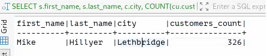
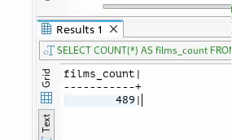
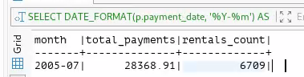
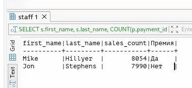
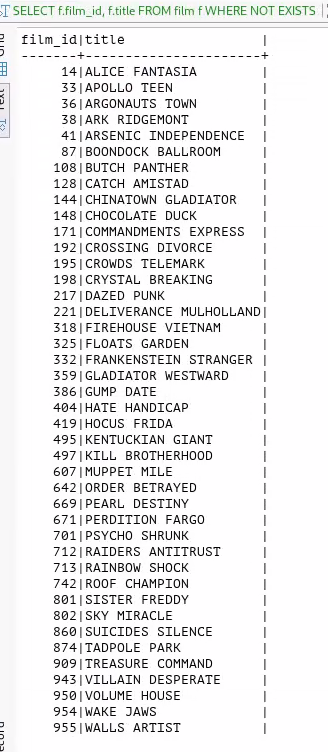

# Домашнее задание к занятию "SQL. Часть 2"- Протопопов Николай Андреевич

### Инструкция по выполнению домашнего задания

   1. Сделайте `fork` данного репозитория к себе в Github и переименуйте его по названию или номеру занятия, например, https://github.com/имя-вашего-репозитория/git-hw или  https://github.com/имя-вашего-репозитория/7-1-ansible-hw).
   2. Выполните клонирование данного репозитория к себе на ПК с помощью команды `git clone`.
   3. Выполните домашнее задание и заполните у себя локально этот файл README.md:
      - впишите вверху название занятия и вашу фамилию и имя
      - в каждом задании добавьте решение в требуемом виде (текст/код/скриншоты/ссылка)
      - для корректного добавления скриншотов воспользуйтесь [инструкцией "Как вставить скриншот в шаблон с решением](https://github.com/netology-code/sys-pattern-homework/blob/main/screen-instruction.md)
      - при оформлении используйте возможности языка разметки md (коротко об этом можно посмотреть в [инструкции  по MarkDown](https://github.com/netology-code/sys-pattern-homework/blob/main/md-instruction.md))
   4. После завершения работы над домашним заданием сделайте коммит (`git commit -m "comment"`) и отправьте его на Github (`git push origin`);
   5. Для проверки домашнего задания преподавателем в личном кабинете прикрепите и отправьте ссылку на решение в виде md-файла в вашем Github.
   6. Любые вопросы по выполнению заданий спрашивайте в чате учебной группы и/или в разделе “Вопросы по заданию” в личном кабинете.
   
Желаем успехов в выполнении домашнего задания!
   
### Дополнительные материалы, которые могут быть полезны для выполнения задания

1. [Руководство по оформлению Markdown файлов](https://gist.github.com/Jekins/2bf2d0638163f1294637#Code)

---
#Комманды для работы с GIT
1. git clone https://github.com/Nikolay-Protopopov/homework-zabbix.git
2. cd homework-zabbix 
3. mkdir screenshots
4. git add README.md screenshots/ 
5. git commit -m "Добавлены скриншоты и обновлен README"
6. git remote set-url origin "https://мой токен@github.com/Nikolay-Protopopov/homework-zabbix.git"
7. git push origin main

### Задание 1
Одним запросом получите информацию о магазине, в котором обслуживается более 300 покупателей, и выведите в результат следующую информацию:

фамилия и имя сотрудника из этого магазина;
город нахождения магазина;
количество пользователей, закреплённых в этом магазине.

SELECT
    s.first_name,
    s.last_name,
    c.city,
    COUNT(cu.customer_id) AS customers_count
FROM store st
JOIN staff s
    ON s.store_id = st.store_id
JOIN customer cu
    ON cu.store_id = st.store_id
JOIN address a
    ON st.address_id = a.address_id
JOIN city c
    ON a.city_id = c.city_id
GROUP BY
    st.store_id,
    s.staff_id,
    c.city
HAVING COUNT(cu.customer_id) > 300;

### Задание 2
Получите количество фильмов, продолжительность которых больше средней продолжительности всех фильмов.

SELECT COUNT(*) AS films_count
FROM film
WHERE length > (
    SELECT AVG(length)
    FROM film
);

### Задание 3
Получите информацию, за какой месяц была получена наибольшая сумма платежей, и добавьте информацию по количеству аренд за этот месяц.

SELECT
    DATE_FORMAT(p.payment_date, '%Y-%m') AS month,
    SUM(p.amount) AS total_payments,
    COUNT(DISTINCT r.rental_id) AS rentals_count
FROM payment p
JOIN rental r
    ON r.rental_id = p.rental_id
GROUP BY month
ORDER BY total_payments DESC
LIMIT 1;

### Задание 4
Посчитайте количество продаж, выполненных каждым продавцом. Добавьте вычисляемую колонку «Премия». Если количество продаж превышает 8000, то значение в колонке будет «Да», иначе должно быть значение «Нет».

SELECT
    s.first_name,
    s.last_name,
    COUNT(p.payment_id) AS sales_count,
    CASE 
        WHEN COUNT(p.payment_id) > 8000 THEN 'Да'
        ELSE 'Нет'
    END AS Премия
FROM staff s
JOIN payment p
    ON s.staff_id = p.staff_id
GROUP BY s.staff_id, s.first_name, s.last_name
ORDER BY sales_count DESC;

### Задание 5
Найдите фильмы, которые ни разу не брали в аренду.

SELECT f.film_id, f.title
FROM film f
WHERE NOT EXISTS (
    SELECT 1
    FROM inventory i
    JOIN rental r ON i.inventory_id = r.inventory_id
    WHERE i.film_id = f.film_id
);

